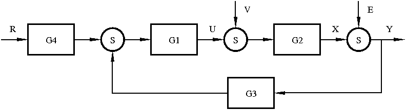

# LabProcesses

```@contents
Depth = 3
```

This package contains an (programming- as well as connection-) interface to serve
as a base for the implementation of lab-process software. The first example of
an implementaiton of this interface is for the ball-and-beam process, which is
used in Lab1 FRTN35: frequency response analysis of the beam. The lab is implemented
in [BallAndBeam.jl](https://gitlab.control.lth.se/processes/BallAndBeam.jl), a
package that makes use of `LabProcesses.jl` to handle the communication with
the lab process and/or a simulated version thereof. This way, the code written
for frequency response analysis of the beam can be run on another process
implementing the same interface (or a simulated version) by changeing a single
line of code :)

## Installation
1. Start julia by typing `julia` in a terminal, make sure the printed info says it's
`v0.6+` running. If not, visit [julialang.org](https://julialang.org/downloads/)
to get the latest release.
2. Install LabProcesses.jl using command `Pkg.clone("https://gitlab.control.lth.se/processes/LabProcesses.jl.git")` Lots of packages will now be installed, this will take some time. If this is your first time using Julia, you might have to run `julia> Pkg.init()` before you install any packages.

# How to implement a new process
### 1.
Locate the file [interface.jl](https://gitlab.control.lth.se/processes/LabProcesses.jl/blob/master/src/interface.jl). When the package is installed, you find its directory under `~/.julia/v0.6/LabProcesses/`, if not, run `julia> Pkg.dir("LabProcesses")` to locate the directory.
(Alternatively, you can copy all definitions from [/interface_implementations/ballandbeam.jl](https://gitlab.control.lth.se/processes/LabProcesses.jl/blob/master/src/interface_implementations/ballandbeam.jl) instead. Maybe it's easier to work from an existing implementaiton.)
### 2.
Copy all function definitions.
### 3.
Create a new file under `/interface_implementations` where you paste all the
copied definitions and implement them. See [/interface_implementations/ballandbeam.jl](https://gitlab.control.lth.se/processes/LabProcesses.jl/blob/master/src/interface_implementations/ballandbeam.jl) for an example.
### 4.
Above all function implementations you must define the process type, e.g,
```julia
struct BallAndBeam <: PhysicalProcess
    h::Float64
    bias::Float64
end
BallAndBeam() = BallAndBeam(0.01, 0.0) # Constructor with default value of sample time
```
Make sure you inherit from `PhysicalProcess` or `SimulatedProcess` as appropriate.
This type must contains fields that hold information about everything that is
relevant to a particular instance of the process. Different ballandbeam-process
have different biases, hence this must be stored. A simulated process would have
to keep track of its state etc. in order to implement the measure and control
methods. See [Types in julia documentation](https://docs.julialang.org/en/stable/manual/types/#Composite-Types-1)
for additional info regarding user defined types and (constructors)[https://docs.julialang.org/en/stable/manual/constructors/].
### 5.
Documentation of all interface functions is available in the file [interface_documentation.jl](https://gitlab.control.lth.se/processes/LabProcesses.jl/blob/master/src/interface_documentation.jl)

# How to control a process
The interface `AbstractProcess` defines the functions `control(P, u)` and `measure(P)`.
These functions can be used to implement your own control loops. A common loop
with a feedback controller and a feedforward filter on the reference is implemented
in the function [`run_control_2DOF`](@ref), where the user can supply $G_1$ and $G_4$
in the diagram below, with the process $P=G_2$.


The macro `@periodically` might come in handy if you want to implement your own loop.
Consider the following example, in which the loop body will be run periodically
with a sample time of `h` seconds.
```julia
for (i,t) = enumerate(0:h:duration)
    @periodically h begin
        y[i] = measure(P)
        r[i] = reference(t)
        u[i] = calc_control(y,r)
        control(P, u[i])
    end
end
```


Often one finds the need to implement a stateful controller, i.e., a function
that has a memory or state. To this end, the type [`SysFilter`](@ref) is
provided. This type is used to implement control loops where a signal is
filtered through a dynamical system, i.e., `U(z) = G1(z)E(z)`.
Usage is demonstrated below, which is a simplified implementation of the block
diagram above (transfer function- and signal names corresponds to the figure).
First two `SysFilter` objects are created, these objects can now be used as
functions of an input, and return the filtered output. The `SysFilter` type takes
care of updating and remembering the state of the system when called.
```julia
G1f = SysFilter(G1)
G4f = SysFilter(G4)
function calc_control(y,r)
    rf = G4f(r)
    e  = rf-y
    u  = G1f(e)
end
```
`G1` and `G4` must here be represented by [`StateSpace`](http://juliacontrol.github.io/ControlSystems.jl/latest/lib/constructors/#ControlSystems.ss) types
from [`ControlSystems.jl`](https://github.com/JuliaControl/ControlSystems.jl), e.g., `G1 = ss(A,B,C,D)`.
`TransferFunction` types can easily be converted to a `StateSpace` by `Gss = ss(Gtf)`.
Continuous time systems can be discretized using `Gd = c2d(Gc, h)[1]`. (The sample time of a process is available through `h = sampletime(P)`.)


# How to implement a Simulated Process
## Linear process
This is very easy, just get a discrete time `StateSpace` model of your process
(if you have a transfer function, `Gss = ss(Gtf)` will do the trick, if you have continuous time, `Gd = c2d(Gc,h)[1]` is your friend).

You now have to implement the methods `control` and `measure` for your simulated type.
The implementation for `BeamSimulator` is shown below
```julia
control(p::BeamSimulator, u) = p.Gf(u)
measure(P) = vecdot(p.Gf.sys.C, p.Gf.state)
```
The `control` method accepts a control signal (`u`) and propagates the system state
(`p.Gf.state`) forward using the statespace model (`p.Gf.sys`) of the beam. The object
`Gf` (of type [`SysFilter`](@ref)) is familiar from the "Control" section above. What it does
is essentially (simplified)
```julia
function Gf(input)
    sys       = Gf.sys
    Gf.state .= sys.A*Gf.state + sys.B*input
    output    = sys.C*Gf.state + sys.D*input
end
```
hence, it just performs one iteration of
```math
x' = Ax + Bu
```
```math
y  = Cx + Du
```

The `measure` method performs the computation `y = Cx`, the reason for the call
to `vecdot` is that `vecdot` produces a scalar output, whereas `C*x` produces a
1-element `Matrix`. A scalar output is preferred in this case since the `Beam`
is SISO.

It should now be obvious which fields are required in the `BeamSimulator` type.
It must know which sample time it has been discretized with, as well as its
discrete-time system model. It must also remember the current state of the system.
This is not needed in a physical process since it kind of remembers its own state.
The system model and its state is conveniently covered by the type [`SysFilter`](@ref),
which handles filtering of a signal through an LTI system.
The full type specification for `BeamSimulator` is given below
```julia
struct BeamSimulator <: SimulatedProcess
    h::Float64
    Gf::SysFilter
    BeamSimulator() = new(0.01, SysFilter(beam_system, 0.01))
    BeamSimulator(h::Real) = new(Float64(h), SysFilter(beam_system, h))
end
```
It contains three fields and two inner constructors. The constructors initializes
the system filter by creating a [`SysFilter`](@ref).
The variable `beam_system` is already defined outside the type specification.
One of the constructors provides a default value for the sample time, in case
the user is unsure about a reasonable value.

## Non-linear process
Your first option is to linearize the process and proceed like above.
Other options include
1. Make `control` perform forward Euler, i.e., `x[t+1] = x[t] + f(x[t],u[t])*h` for a general system model ``x' = f(x,u); y = g(x,u)`` and sample time ``h``.
2. Integrate the system model using some fancy method like Runge-Kutta. See [DifferentialEquations.jl](http://docs.juliadiffeq.org/stable/types/discrete_types.html) for discrete-time solving of ODEs (don't be discouraged, this is almost as simple as forward Euler above).

# Exported functions and types
```@autodocs
Modules = [LabProcesses]
Private = false
Pages   = ["LabProcesses.jl", "controllers.jl", "reference_generators.jl", "utilities.jl"]
```

# Process interface specification
All processes must implement the following interface. See the existing
implementations in the folder `interface_implementations` for guidance.

```@autodocs
Modules = [LabProcesses]
Private = false
Pages   = ["interface_documentation.jl"]
```

# Index

```@index
```
